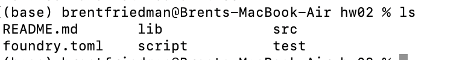

# Homework 2 - Deploy Your ERC721

In this homework, you will use Foundry for the first time to deploy your own ERC721 token (NFT) to a live blockchain. 

Created by Daniel Gushchyan

## Using Foundry

### Installing Foundry

First, let's install Foundry. Foundry Book is going to be a resource that we'll reference often, as getting comfortable with reading documentation is a hugely valuable skill (and in many cases, the only resource for help).

We will walk you through the steps of installing Foundry, but if you are interested in reading through yourself, here is the link: https://book.getfoundry.sh/getting-started/installation

#### Step 1: Installing Foundryup
Foundryup is the Foundry toolchain installer. Open up a new terminal session and run this command:
```bash
curl -L https://foundry.paradigm.xyz | bash
```

After running this command, instructions will pop up in your terminal explaining how to add ```foundryup``` as a command on your machine.


#### Step 2: Installing the Rust Compiler and Cargo
Next we will install the Rust Compiler and Cargo, which is the Rust package manager. Run the following command and follow and on-screen instructions:

```bash
curl --proto '=https' --tlsv1.2 -sSf https://sh.rustup.rs | sh
```

#### Step 3: Installing Binaries
We now need to install the `forge`, `cast`, `chisel`, and `anvil` binaries from the foundry project hosted on GitHub. Run the following command to install all at once (**Downloading and compiling may take a few minutes!**)
```bash
cargo install --git https://github.com/foundry-rs/foundry --profile local forge cast chisel anvil

```

You are now all set up to proceed with this homework!


### Creating our Foundry project and Writing the NFT

In this homework, we'll be following the simple NFT guide provided by Foundry. 

https://book.getfoundry.sh/tutorials/solmate-nft


Start by setting up a Foundry project following the steps outlined below:

#### Step 1: In your terminal, cd into whichevery directory you would like to create this project
#### Step 2: Run the following command to create a foundry project called hw02:
```bash
forge init hw02
```
#### Step 3: Installing dependencies
We will also install Solmate for their ERC721 implementation, as well as some OpenZeppelin utility libraries. Install the dependencies by running the following commands from the root of your project (**cd into hw02 and run this command**):

```bash
forge install transmissions11/solmate Openzeppelin/openzeppelin-contracts
```

These dependencies will be added as git submodules to your project.

If you have followed the instructions correctly your project should be structured like this:



### Implement a basic NFT

Now, open VSCode and install the solidity extension.

We are then going to rename the boilerplate contract in `src/Counter.sol` to `src/NFT.sol` and replace the code:

```solidity
// SPDX-License-Identifier: UNLICENSED
pragma solidity 0.8.10;

import "solmate/tokens/ERC721.sol";
import "openzeppelin-contracts/contracts/utils/Strings.sol";

contract NFT is ERC721 {
    uint256 public currentTokenId;

    constructor(
        string memory _name,
        string memory _symbol
    ) ERC721(_name, _symbol) {}

    function mintTo(address recipient) public payable returns (uint256) {
        uint256 newItemId = ++currentTokenId;
        _safeMint(recipient, newItemId);
        return newItemId;
    }

    function tokenURI(uint256 id) public view virtual override returns (string memory) {
        return Strings.toString(id);
    }
}
```
**If you get an error with the import statements, checkout this Stack Overflow post: https://stackoverflow.com/questions/67321111/file-import-callback-not-supported**


Go ahead and comment out the code in `script/Counter.sol` and `test/Counter.sol` for today's purposes.

Let's take a look at this very basic implementation of an NFT. We start by importing two contracts from our git submodules. We import solmate's gas optimized implementation of the ERC721 standard which our NFT contract will inherit from. Our constructor takes the `_name` and `_symbol` arguments for our NFT and passes them on to the constructor of the parent ERC721 implementation. Lastly we implement the `mintTo` function which allows anyone to mint an NFT. This function increments the `currentTokenId` and makes use of the `_safeMint` function of our parent contract.

### Compile & deploy with forge

To compile the NFT contract run `forge build`. You might experience a build failure due to wrong mapping:

```text
Error:
Compiler run failed
error[6275]: ParserError: Source "lib/openzeppelin-contracts/contracts/contracts/utils/Strings.sol" not found: File not found. Searched the following locations: "/PATH/TO/REPO".
 --> src/NFT.sol:5:1:
  |
5 | import "openzeppelin-contracts/contracts/utils/Strings.sol";
  | ^^^^^^^^^^^^^^^^^^^^^^^^^^^^^^^^^^^^^^^^^^^^^^^^^^^^^^^^^^^^
```

this can be fixed by setting up the correct remapping. Create a file `remappings.txt` in your project and add the line

```text
openzeppelin-contracts/=lib/openzeppelin-contracts/
```

(You can find out more on remappings in [the dependencies documentation](../projects/dependencies.md).

### Starting a Local Chain

Before we deploy our code to a Mainnet, we use a testnet to see how our smart contract interacts in the wild. Before that, we deploy our smart contracts to a local 'fake' blockchain where we can do fast testing.

Foundry provides a tool called Anvil for this. From Foundry Book:
>Anvil is a local testnet node shipped with Foundry. You can use it for testing your contracts from frontends or for interacting over RPC.

Today, we just need the basics of Anvil. Start a new local node by opening a new terminal window (you'll need a window dedicated to running anvil), and type `anvil`. 

You should see a list of accounts and private keys available for use, as well as the address and port that the node is listening on.

Copy the address and port.

### Deploying to Our Local Chain

By default the compiler output will be in the `out` directory. To deploy our compiled contract with Forge we have to set environment variables for the RPC endpoint and the private key we want to use to deploy. 

We can set environment variables by running:

```bash
export RPC_URL=<Your RPC endpoint>
export PRIVATE_KEY=<Your wallets private key>
```

In this case, we want to deploy to localhost (where anvil is running). In a separate window from anvil, create your environment variables. They should look like:

```bash
export RPC_URL=http://localhost:8545
export PRIVATE_KEY=<copy one from anvil>
```
For the private key, just use one of the already funded accounts that Anvil provided.

Once set, you can deploy your NFT with Forge by running the below command while adding the relevant constructor arguments to the NFT contract:

```bash
forge create NFT --rpc-url=$RPC_URL --private-key=$PRIVATE_KEY --constructor-args <name> <symbol>
```

If successfully deployed, you will see the deploying wallet's address, the contract's address as well as the transaction hash printed to your terminal. 

You will also see your transaction details and the created contract on Anvil's output.

Congrats! You've deployed a contract. You can use `cast` to interact with this contract in your terminal. Check out the Foundry Book guide to learn how to mint an NFT and read contract data from it:

https://book.getfoundry.sh/tutorials/solmate-nft

Now let's do this on a real blockchain!
 
## Deploying To The World

To deploy to a real blockchain instead of anvil, we'll need to first create and fund an Ethereum account.

### Installing Metamask

First, please install Metamask if you haven't already. One of our B@B Education members wrote [a guide that can help](https://sehyunc.notion.site/Metamask-Guide-a774de1a6516458db7904c061a4682aa).

By default, Metamask only displays Ethereum Mainnet and a few other Ethereum testnets. We'll be using the Goerli testnet, which your wallet should already have saved.

>⚠️ I **strongly** advise making a new account for soley development purposes. Don't use an address that contains real assets.

<u>To make a new account</u>
Click the profile icon and "+ Create Account".

We will be exporting the private key of this account and you never want to keep a loaded wallet's private key hanging around. For example, pushing your private key to GitHub will lead to bots instantly draining your account.

### Getting Testnet ETH

Before we can send transactions on Goerli, we'll need some ETH. Since tokens don't have any real value on testnets, various "faucets" exist which dispense ETH freely. 

Here are a few faucets which you can use to get ether on Goerli.

* https://faucet.paradigm.xyz
* https://www.alchemy.com/dapps/goerli-faucet

### Exporting Private Key

Get your address' private key from Metamask. Here's a guide:
https://metamask.zendesk.com/hc/en-us/articles/360015289632-How-to-export-an-account-s-private-keyLinks to an external site.

>⚠️ Make sure this private key does not get saved or shared anywhere. Don't include it in your code (use .env variables). 

## Back To Foundry

Now that we have a funded account with which we can send transactions to Goerli with, let's go back to Foundry and use the `forge` tool to do just that.

For our RPC endpoint, we will no longer be using our localhost. Rather, we'll need to connect to a real Ethereum node running the Goerli testnet somewhere on the internet. Let's use [Ankr's](https://www.ankr.com/rpc/eth/eth_goerli/) free endpoint.

As for the private key, we'll now be using our new Ethereum account's private key.

Run this following command:

```forge create NFT --rpc-url=https://rpc.ankr.com/eth_goerli --private-key=<YOUR PRIVATE KEY> --constructor-args <NAME> <SYMBOL>```

If everything went well, you should see your new contract's address printed to your terminal!

## Submission

Submit the contract address that you deployed to to this form:

https://forms.gle/9bcgWQeBcqFJpiPg9

Congratulations! You've now deployed your (potentially) first smart contract! In the next class, we'll go further in depth into Solidity so that you'll be ready to develop your own code :) 

Please email us if you have any issues!