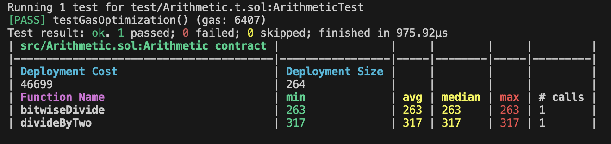

# Getting Started

    curl -L https://foundry.paradigm.xyz | bash
    foundryup
    brew install libusb

**If you're text editor says "foundry-std not found, run the following command:"

        forge install foundry-rs/forge-std

# Running Test

Testing for this homework is slightly scuffed, as the differences in gas based on the optimization implementations may be negligible. This means that your implementation may pass the tests, but not actually be optimized. It is important for you to ensure that the gas report reflects an optimized implementation. 

Let's walk through a simple gas report. Here, you can see that the average gas consumption for bitwiseDivide is 263, while the divideByTwo function consumes 317. This means that divideByTwo is optimized.

- Test for individual file with gas report

        forge test --match-path test/Arithmetic.t.sol --gas-report

# Gas Optimization

Optimize the following functions by utilizing the gas optimization tactics that were outlined in lecture:

- Addition.sol
- Arithmetic.sol
- ArrayLength.sol
- CDMem.sol
- DataType.sol
- ExternalCallOptimization.sol
- GarbageCollection.sol
- NestedIf.sol
- PackVariables.sol

# References

1. https://betterprogramming.pub/how-to-write-smart-contracts-that-optimize-gas-spent-on-ethereum-30b5e9c5db85?gi=227bef2ca134
2. https://mudit.blog/solidity-gas-optimization-tips/
3. https://blog.polymath.network/solidity-tips-and-tricks-to-save-gas-and-reduce-bytecode-size-c44580b218e6
4. https://gist.github.com/hrkrshnn/ee8fabd532058307229d65dcd5836ddc
5. https://medium.com/coinmonks/8-ways-of-reducing-the-gas-consumption-of-your-smart-contracts-9a506b339c0a
6. https://ethereum.stackexchange.com/questions/28813/how-to-write-an-optimized-gas-cost-smart-contract
7. https://forum.openzeppelin.com/t/a-collection-of-gas-optimisation-tricks/19966
8. https://medium.com/coinmonks/8-ways-of-reducing-the-gas-consumption-of-your-smart-contracts-9a506b339c0a
